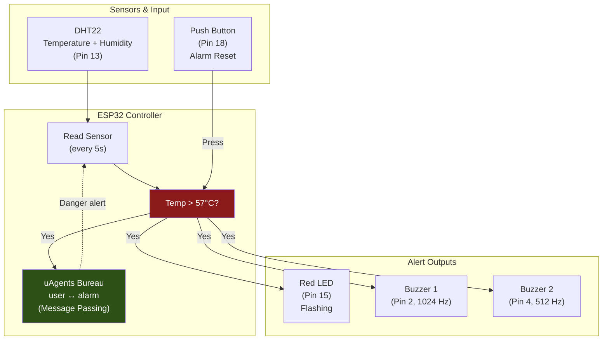

# Fire Alarm System

An IoT fire alarm system built on ESP32 (MicroPython) with a DHT22 temperature sensor, dual buzzers, LED indicator, and multi-agent communication using [uAgents](https://github.com/fetchai/uAgents). Triggers an alarm when the temperature exceeds 57 degrees C with manual reset via a physical button.



## Features

- **DHT22 Sensor** — Real-time temperature and humidity monitoring
- **Dual-frequency Alarm** — Two buzzers at 1024 Hz and 512 Hz for distinct alert tones
- **LED Indicator** — Flashing red LED during alarm state
- **Agent Communication** — Fetch.ai uAgents framework for inter-agent messaging
- **Manual Reset** — Physical push button to silence the alarm
- **Configurable Threshold** — Default trigger at 57 degrees C (typical fire detection range)

## Circuit Setup

| Component | ESP32 Pin | Details |
|---|---|---|
| DHT22 SDA | D13 | Temperature/humidity data |
| DHT22 VCC | VIN | Power supply |
| DHT22 GND | GND | Ground |
| Red LED (+) | D15 | Alert indicator |
| Buzzer 1 | D2 | 1024 Hz tone |
| Buzzer 2 | D4 | 512 Hz tone |
| Push Button | D18 | Alarm reset |

## Quick Start

### Wokwi Simulator

1. Go to [wokwi.com/projects/new/micropython-esp32](https://wokwi.com/projects/new/micropython-esp32)
2. Paste `alarm.py` into the code editor
3. Paste `CONNECTIONS.json` into the diagram tab
4. Run the simulation

> Note: The Wokwi simulator defaults to 27 degrees C ambient, so the alarm won't trigger automatically. Modify the threshold in code for testing.

### Physical Hardware

```bash
# Install uAgents
pip install uagents

# Flash alarm.py to ESP32 via MicroPython
```

## Project Structure

```
Fire-Alarm/
├── alarm.py            # Main program (sensor reading, agents, alarm logic)
├── CONNECTIONS.json    # Wokwi circuit diagram (ESP32 + DHT22 + buzzers + LED + button)
└── LICENSE
```

## Tech Stack

- **MicroPython** (ESP32)
- **DHT22** sensor
- **Fetch.ai uAgents** framework
- **Wokwi** simulator

## Contributing

1. Fork the repository
2. Add features (SMS alerts, WiFi notifications, multi-sensor support)
3. Submit a pull request

## License

This project is licensed under the GPL-3.0 License. See [LICENSE](LICENSE) for details.
